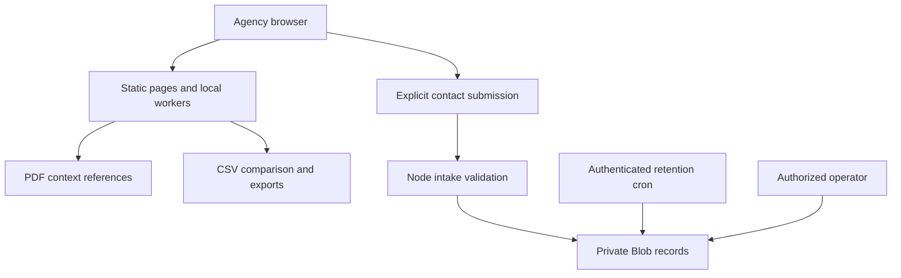

# CivicReconcile — municipal revenue assurance launch blueprint

Implementation record: 4 October 2026. The launch brand is CivicReconcile. `civicreconcile.com` was returned as available by Vercel's live domain registry check; availability is transient. No purchase, trademark clearance or custom-domain attachment has occurred. The current public address remains https://tallyridge-assurance-2.vercel.app.

## Investment thesis and launch decision

Build a focused municipal fee assurance business that earns recurring monitoring contracts through a bounded historical review. Start with California city/county development impact fees, one fee program and three fiscal years. Do not present utility connection fees, school fees or another state's impact fees as interchangeable. Geography is an implementation assumption pending founder confirmation, not a customer fact.

The economic buyer is a Finance Director, Internal Auditor or Assistant City Manager. Planning/building and treasury/accounting staff are essential collaborators and source owners. Position the review as reconciliation support with a traceable exception register, rather than blame for staff or a promise of legal correctness. Review outputs may identify undercharges, overcharges, timing differences, permitted credits and fund mispostings; several of these create liabilities or accounting corrections rather than recoverable revenue.

The initial product is software-assisted review with explicit agency validation. The release includes self-serve local tools and real contact intake. It does not imply a retained forensic accountant, CPA firm, legal team, authorized enterprise data plane or revenue recovered. Independently engaged professionals must have verified scope, credentials, independence and insurance before their work is sold.

## Original-site audit and remediation

| Finding | Adoption or diligence consequence | Implemented response | Remaining operational requirement |
|---|---|---|---|
| Contact form generated a local brief only | Lost leads despite apparent CTA | Explicit submit endpoint, private storage and receipt; local brief remains available | Named intake owner and response coverage |
| No published commercial baseline | Buyers could not qualify budget | Public $7,500 scoped baseline and $18,000 annual monitoring starting prices | Approved quote, entity, tax and payment terms |
| Ambiguous automation/services boundary | Procurement could not assess deliverable | Methodology identifies deterministic comparison and agency/professional responsibilities | Engagement contract and qualified delivery capacity |
| Static readiness checklist | No immediate evidence-bearing value | Two-PDF local context matrix with page references and JSON export | OCR and substantive professional review separately scoped |
| Sample counts inconsistent | Credibility issue | 2,418 records, 49 exceptions and 2,369 remaining records | Sample remains prominently synthetic |
| No record-comparison utility | No reproducible product evidence | Effective-dated CSV comparison, cents arithmetic, exclusions and export | Agency-approved fee interpretation and fund crosswalk |
| Domain/brand lacked distinct municipal signal | Generic positioning | CivicReconcile and Public Revenue Review descriptor | Register domain and undertake clearance |
| Cooperative/recovery guidance overstated certainty | Procurement and legal exposure | Eligibility checklist, capped realized-cash terms and explicit exclusions | Agency counsel/purchasing approval for each engagement |

## Market and competitor discipline

Public finance assurance competes against doing nothing, internal spreadsheet work, ERP reporting, consultants and independent auditors. Do not assert incumbents only record data, consultants examine exactly 20 permits, or all studies cost $50,000–$150,000: those claims were not substantiated. Tyler documents reconciliation capabilities; TischlerBise describes fee expertise and fiscal software. The defensible wedge is reproducible source-to-exception tracing across heterogeneous records, with transparent limits and a light deployment footprint.

| Alternative | Strength | CivicReconcile's proposed differentiation | Proof required to win |
|---|---|---|---|
| Municipal ERP/reporting | Existing system of record and integrations | Cross-system historical fee-authority and posting comparison | Benchmark against native reports; no duplicate work |
| Fee consultants | Jurisdiction expertise and study authorship | Repeatable record coverage and evidence organization | Expert-approved interpretation; measured delivery time |
| External/internal audit | Independence, assurance and controls assessment | Granular operational exception register before/alongside audit | No substitution for formal audit opinion |
| Spreadsheets/internal staff | Local knowledge and low purchase friction | Exact arithmetic, effective dates, excluded rows and repeatable export | Time saved against observed staff workflow |

California Government Code §66001 addresses purpose, use and reasonable relationships for covered fees. §66006 addresses separate accounting and reporting. Program scope and applicability must be checked by counsel against current law and facts. Sheetz v. County of El Dorado rejects a blanket legislative exemption from the constitutional scrutiny at issue; it does not make every local fee unlawful or establish automatic recoverability. A context match in an ACFR is not statutory compliance evidence.

## Commercial packaging

| Offer | Public starting price | Included scope | Exclusions and expansion triggers |
|---|---:|---|---|
| Public document context check | $0 | Two searchable public PDFs; local processing; page references | No OCR, legal conclusion or fee/ledger reconciliation |
| Historical baseline | $7,500 one-time | One jurisdiction/program, up to three fiscal years and 2,500 records; source inventory and staff-review register | Data cleanup, integrations, additional programs/records, professional opinions |
| Annual monitoring | $18,000/year | Up to three programs, 10,000 records/year and quarterly review cadence under contract | Increased coverage/cadence and integrations explicitly quoted |
| Optional recovery structure | 15% of eligible realized cash; $24,500 cap | Only if independently lawful, approved and separately contracted | No percentage of misallocations, estimates, overcharges, refunded sums or already scheduled collections |

The recovery fee does not bypass appropriation, procurement, professional independence or collection law. A waived diagnostic and a separately payable diagnostic must not be described as the same offer. Specify the baseline, exclusions, causal attribution, collection window, refunds, dispute handling and documentary evidence before signing. The agency decides and executes collection; CivicReconcile cannot demand payment from developers through this tool.

For realized eligible recovery R, percentage p=0.15 and cap K=$24,500:

F = min(pR, K); retained recovery = R − F − incremental agency collection cost.

At R=$100,000 and collection cost=$5,000, F=$15,000 and retained recovery=$80,000. A $7,500 diagnostic, if separately contracted, reduces this to $72,500; the quote must state whether it is additional, credited or waived. A fund transfer of $100,000 produces zero eligible recovery under these terms. No guaranteed recovery or break-even claim is made.

Avoid charging public reviewers for seats or each approval. Municipal buyers need forecastable appropriations. Expansion should follow approved program scope, annual record bands and review cadence. Publish overage quotes before processing and provide export/exit terms. CivicReconcile pricing is separate from the Custodia seat/cryptographic-transaction proposal; those metrics do not naturally express a municipal fee review's value.

## Acquisition and procurement pathway

1. Secure one tightly scoped design-partner engagement through the agency's lawful route. Build a written data inventory and eligibility screen before quoting. Target finance/internal audit; invite records owners early.
2. Use the public-document tool to demonstrate source references. Its output should read context located/not located, never manufacture a high-risk badge from missing keywords. Offer a full review based on unmet evidence requirements, not fear.
3. Deliver a reviewed register with source/date/rule/amount/exception/owner/disposition. Track confirmed corrections, refunds, eligible receipts and unresolved items separately. Obtain explicit authorization before any testimonial or public case study.
4. Compete for an anchor award with a lawful cooperative provision where permitted. Record solicitation, award, amendment, term, scope and eligibility. Another jurisdiction's purchasing counsel must verify its own authority and fit. No existing anchor award is claimed and no two-week deployment is promised.
5. Expand through annual monitoring and referrals approved by agencies. Invite external reviewers only into explicit, least-privilege workspaces once that product exists. Public findings must not be shared automatically across tenants. Referral CAC is measured, not declared zero.

| Stage | Exit evidence | Owner | Scale gate |
|---|---|---|---|
| Discovery | Covered fee authority, fiscal years, record sources | Finance + delivery lead | Scope feasible and buyer identified |
| Purchasing | Budget/authority, process, terms, security questionnaire | Agency purchasing/counsel | Executed agreement |
| Preparation | Approved export, schedule versions, credit and fund map | Agency records owners | Completeness exceptions documented |
| Review | Reproducible calculations and named dispositions | Finance/internal audit | Professional issues separately resolved |
| Outcomes | Posted corrections, actual receipts/refunds | Agency finance | Attribution and evidence approved |
| Renewal | Monitoring plan and capacity budget | Economic buyer | Paid recurring agreement |

## 24-month operating model

`forecast.csv` contains all 24 monthly rows and model variables. Month 1 starts with the first paying annual customer, not today's observed traction. New logos per month are 1 in months 1–3, 2 in 4–6, 3 in 7–9, 4 in 10–12, 5 in 13–15, 6 in 16–18, 7 in 19–21 and 8 in 22–24. One oldest customer leaves at months 12, 18 and 24. These are planning hypotheses and require sufficient upstream qualified pipeline, sales capacity and delivery staffing.

Opening cohort MRR grows 1% monthly through contracted scope expansion, not automatic invoice increases. New logo MRR is $1,500. Annual recurring revenue equals 12 × ending MRR; baseline services are excluded. Trailing 12-month NRR tracks only cohorts present 12 months earlier, including churn and expansion. Earlier NRR is blank because a 12-month period has not elapsed.

MRR_m = 1.01 × MRR_(m−1) − churned_cohort_MRR_m + 1,500 × new_logos_m.

NRR_m = revenue_m of surviving cohorts active at m−12 / revenue_(m−12) of those original cohorts.

The model assumes 75% subscription contribution margin, 55% baseline contribution margin, $6,000 acquisition cost per new logo, and fixed monthly operating costs of $25,000 in months 1–12/$40,000 in 13–24. Service fees are recognized at delivery in the acquisition month solely for modeling; cash collections and deferred annual subscription revenue require a separate cashflow model. The forecast excludes taxes, working capital, capex, payment delays, staffing step costs beyond assumed margins and financing. It is not a valuation, a bookings ledger or observed NRR.

Required monthly metrics: qualified municipal opportunities, lawful purchasing cycle, win rate, source completeness, excluded-row rate, review hours per 1,000 records, time to signed disposition, subscription margin, service margin, realized eligible recovery, refunds, renewal and cohort NRR. Report denominator and measurement window. Do not mix service revenue into SaaS ARR.

## Technical architecture and assurance boundary

The PDF/CSV processing path has no source-data upload. Files exist in browser memory until cleared or the tab is closed; downloaded exports remain on the user's device. PDF parsing disables eval, limits pages/file size and rejects unsuitable text extraction. These limits do not sandbox every browser parser vulnerability; dependencies and browser versions must be maintained.

The intake API uses exact same-origin checks, strict lengths, UUID retry semantics, private Blob access and atomic rate slots. It retains no raw IP, instead using an HMAC-derived network key. Content hashes identify bytes; they are not a notarized ledger. Contact records are mutable/deletable by authorized infrastructure operators. Private storage is not advertised as immutable or tamper-proof.

Future institutional architecture must separately implement authenticated tenant membership, Postgres FORCE RLS with non-owner runtime roles, tenant-aware queues, idempotent persistent review checkpoints, dual approval/segregation of duties, private object storage, versioned policy inputs and independently verifiable signed event roots. Cross-tenant review invitations must bind scope, recipient, expiry, source version and revocation. A client-provided tenant header or an LLM conclusion must never authorize release.

No commercial Vercel deployment is represented as FedRAMP High or DoD IL5 authorized. An actual sovereign path requires an agency-defined boundary, authorized hosting/services, validated cryptographic modules in their approved operating configuration, control implementation/evidence, independent assessment and authorization by the appropriate authority. GovCloud availability alone is not authorization. Conventional commercial API endpoints must not receive regulated government datasets under an assumed sovereign approval.

## Operator launch checklist

Before accepting paid delivery, complete legal entity/W-9, insurance, credential and professional scope verification, approved MSA/SOW/DPA, intake ownership, capacity plan, accounts-payable instructions, retention owner and incident contact. Before production agency data, commission identity/access controls and agency-approved deployment, backup/restore, deletion/export and incident-response evidence. Before a cooperative pitch, possess the executed eligible award and current supporting documents. Before registering the name, complete appropriate clearance.

## Primary evidence reviewed

- California Legislature, Government Code §66001: https://leginfo.legislature.ca.gov/faces/codes_displaySection.xhtml?lawCode=GOV&sectionNum=66001.
- California Legislature, Government Code §66006: https://leginfo.legislature.ca.gov/faces/codes_displaySection.xhtml?lawCode=GOV&sectionNum=66006. — current applicability/text must be verified for engagement; official retrieval was inconsistent during this audit.
- U.S. Supreme Court, Sheetz v. County of El Dorado: https://www.supremecourt.gov/opinions/23pdf/22-1074_bqmd.pdf
- California DGS, Leveraged Procurement Agreements: https://www.dgs.ca.gov/PD/Services/Page-Content/Procurement-Division-Services-List-Folder/Find-Leveraged-Procurement-Agreements
- Tyler Technologies, Enterprise ERP official product/documentation: https://www.tylertech.com/products/enterprise-erp
- TischlerBise, official firm capabilities: https://www.tischlerbise.com/

This record distinguishes implemented software, published proposed terms, assumed forecasts and uncommissioned services. No synthetic demo or forecast represents a real agency engagement or recovered revenue.
